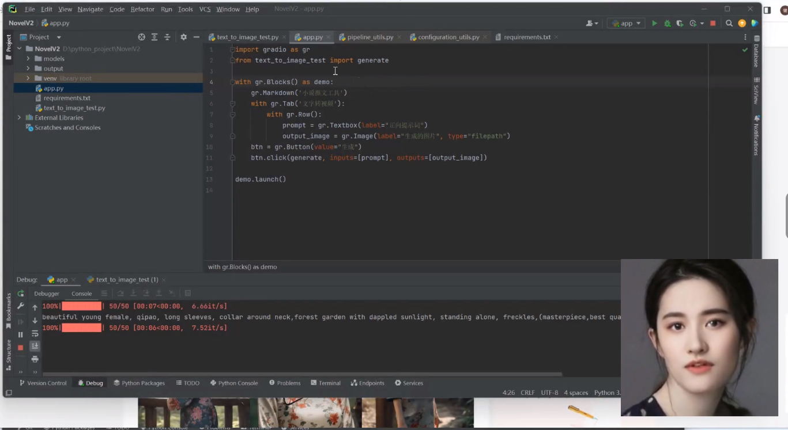

#generate_video

##这是两个关于图片和音频驱动头像的开源项目整合
1. [dreamTalk](https://github.com/ali-vilab/dreamtalk)
2. [hallo](https://github.com/fudan-generative-vision/hallo)

## 描述

一个简单的视频添加人物头像说话学习项目，因许可证原因，此项目仅用于自己学习使用。

## 示例

 
 

## 使用相关技术:
   -[hallo](https://github.com/fudan-generative-vision/hallo)
   - [dreamTalk](https://github.com/ali-vilab/dreamtalk)
   - [codeFormer](https://github.com/sczhou/CodeFormer)
   - [gradio](https://github.com/gradio-app/gradio)
   - [moviepy](https://github.com/Zulko/moviepy)
    